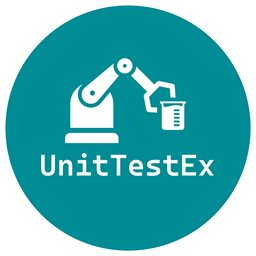

 

 

## Introduction

Under construction.

 

## Other repos

These other _Avanade_ repositories leverage _UnitTestEx_ to provide unit testing capabilities:
- [Beef](https://github.com/Avanade/Beef) - Business Entity Execution Framework to enable industralisation of API development.

 

## License

_OnRamp_ is open source under the [MIT license](./LICENSE) and is free for commercial use.

 

## Contributing

One of the easiest ways to contribute is to participate in discussions on GitHub issues. You can also contribute by submitting pull requests (PR) with code changes. Contributions are welcome. See information on [contributing](./CONTRIBUTING.md), as well as our [code of conduct](https://avanade.github.io/code-of-conduct/).

 

## Security

See our [security disclosure](./SECURITY.md) policy.

 

## Who is Avanade?

[Avanade](https://www.avanade.com) is the leading provider of innovative digital and cloud services, business solutions and design-led experiences on the Microsoft ecosystem, and the power behind the Accenture Microsoft Business Group.
